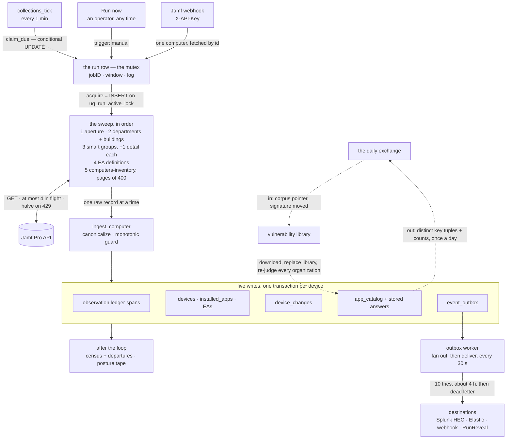
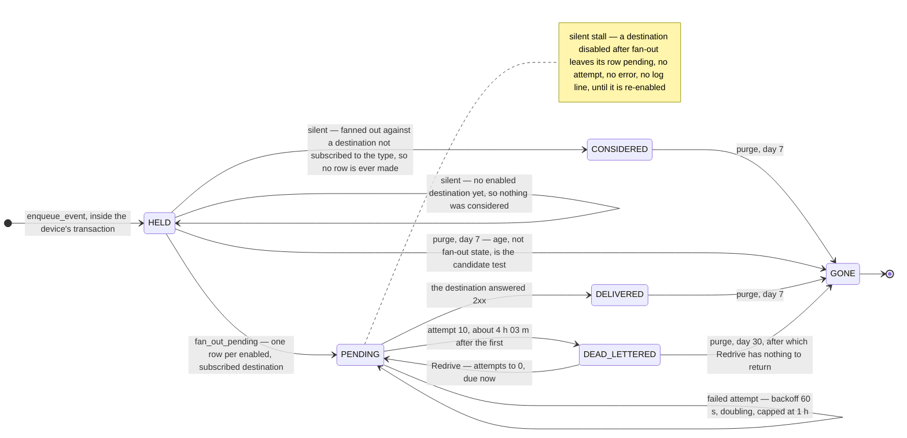

# The architecture: how a Mac in Jamf Pro becomes an event in your SIEM

Status: **map** (2026-09-18, [#562](https://github.com/LoonSecIO/LoonInspect/issues/562)) ·
Every fact here is read out of the code and names the symbol that holds it, never a line
number — the contracts themselves live in the files [`README.md`](README.md) indexes, and
where one of them rules a detail, it is linked. Read §6 second: the provider seam is what
a second MDM plugs into.

## 1. The ninety-second explanation

1. **A connection** is one Jamf Pro tenant: its URL and a stored API credential
   (`app.mdm.credentials`, encrypted at rest).
2. **Collections are rows** — what to read and when. A new connection starts with three:
   a daily device sweep, an hourly catalog refresh, and the scope a webhook fetches under
   (`app.mdm.collections.default_collections`). The schedule is a column, not a cron, so
   changing it is an ordinary write and six containers behave like one.
3. **The minute tick claims.** `collections_tick` asks the database which collections are
   due; `app.mdm.collections.claim_due` claims each with one conditional UPDATE
   (`WHERE next_due_at <= now`) that advances `next_due_at`. Two processes both issue it;
   one changes a row and runs it, the other changes nothing and moves on.
4. **The run row is the mutex.** Acquiring a run *is* taking the lock: an INSERT against
   the partial unique index `uq_run_active_lock` on
   `(tenant_id, mdm_connection_id, lock_class)` where the run is `running` and its lock
   class is not `webhook`. The loser takes an integrity error, not a second sweep. The run
   also carries the `jobID` stamped on every event of the pull, the time window that
   becomes `_time`, and the log an operator reads; a process that dies is reclaimed by
   heartbeat, not at startup ([`runs.md`](runs.md), `app.core.runs`).
5. **The sweep reads in a fixed order** (`app.mdm.service._sync_jamf`): the aperture —
   Jamf's version and its inventory-collection settings — then departments and buildings,
   then smart groups with one detail read each, then extension-attribute definitions, then
   `computers-inventory` in pages of 400 with at most four in flight. Names before ids and
   definitions before devices, so nothing a device references is older than the device.
6. **Every device goes through one function.** `ingest_computer` canonicalizes the record,
   asks the ledger's monotonic guard whether it is older than what is stored, writes the
   observation span, and hands `process_sync` the current state. Five writes, one
   transaction per device. A device that raises is rolled back alone and the sweep carries
   on until failures pass the tolerance (`sweep_failures_allowed`).
7. **After the loop** the census closes the sweep — which Macs Jamf did not return this
   pass, and what that means (`_reconcile_device_census`) — and a full sweep's last act is
   the posture tape (`app.core.posture.record_full_sweep_snapshot`).
8. **Delivery is decoupled.** Events land in `event_outbox` inside the device's own
   transaction; the outbox worker fans them out and delivers them every 30 seconds. A slow
   or dead SIEM can never slow a sweep or delay a webhook's ACK.
9. **A webhook is the same function for one Mac.** Jamf Pro POSTs with the shared secret
   as `X-API-Key`, the handler fetches that one computer by id and ingests it
   (`ingest_webhook`). It runs inside a run of its own, in a lock class the unique index
   excludes, so it never queues behind a forty-minute sweep.

## 2. Figure 1 — the Jamf data path

The dotted path is the only one that reaches back into a tenant's own answers. An unmoved
signature downloads nothing at all, which is what makes a daily conversation affordable
(`app.core.vuln_library.load_epoch_if_new`); a moved one replaces the whole library, after
which every organization's stored answers are re-judged against the new epoch — hourly by
`refresh_tenant`, and on import itself under
[#554](https://github.com/LoonSecIO/LoonInspect/issues/554).

## 3. Figure 2 — the life of one outbox event

Three of those are silent by design, and only the first is **held**. With no enabled
destination `fan_out_pending` returns before it reads a single event, `fanned_out` stays
false, and the ordinary pass delivers the backlog the moment a destination is added — the
setup stepper calls that step optional, so a whole baseline sweep normally lands this way.
The second is not held but **considered**: a destination that exists and is not subscribed to
the type marks the event `fanned_out` with **no delivery row at all**, and nothing revisits a
considered event, so subscribing afterwards will not deliver it — which is why adding a
destination replays one backlog and not another. The third is neither: a destination disabled
between fan-out and delivery leaves its row **pending with no error and no log line**, and it
resumes if re-enabled. Both undelivered cases age out on a delivered event's clock: age, not
fan-out state, is the purge's candidate test. The clocks are `event_outbox_retention_days` (7)
and `dead_letter_retention_days` (30) — see `fan_out_pending` and `purge_delivered_events`.

## 4. The scheduler: eight jobs

Registered in `backend/app/main.py`, every one of them behind `SCHEDULER_ENABLED`. Cron
jobs fire in `SYNC_TIMEZONE`, not UTC.

| Job | Cadence | What it does |
| --- | --- | --- |
| `collections_tick` | every 1 min | Claims the collections that are due in each tenant and runs them in turn. |
| `sign_in_tick` | every 1 min, and once at startup | Starts and retires held Jamf sign-ins to match each connection's token-cache mode. |
| `outbox_worker_tick` | every 30 s | Fans out new events, then attempts every delivery due; one process at a time per tenant (`outbox_tick_lock`). |
| `sharing_exchange_tick` | every 5 min | Sends at most once per tenant per day, at a minute of day derived from its submission UUID. |
| `hourly_jamf_patch_sync` | hourly, :00 | Pulls the global Jamf Patch catalog, rebuilds the lookup, then re-judges every tenant's app catalog. |
| `hourly_session_cleanup` | hourly, :30 | Deletes sessions a day past expiry or revocation. |
| `outbox_cleanup` | daily, 02:45 | Purges events past retention, held ones included — age is the candidate test, and a delivery still pending or a dead letter inside its own window is what holds an event back. |
| `run_cleanup` | daily, 02:50 | Purges finished runs, their log lines and closed alert latches past `run_retention_days`. |

## 5. What a pull costs Jamf

The order below is the order the code issues them (`_sync_jamf`, `app.mdm.jamf.client`).
The right-hand column prices one device sweep of a 1,000-Mac tenant with 60 smart groups.

| Call | Once per | Count |
| --- | --- | --- |
| `POST /api/oauth/token` | client, unless a held sign-in serves it | 1 |
| `GET /api/v1/jamf-pro-version` | run | 1 |
| `GET /api/v2/computer-inventory-collection-settings` | run | 1 |
| `GET /api/v1/departments` | run | 1 |
| `GET /api/v1/buildings` | run | 1 |
| `GET /api/v3/computer-groups/smart-groups` | run, pages of 100 | 1 |
| `GET /api/v3/computer-groups/smart-groups/{id}` | smart group | 60 |
| `GET /api/v1/computer-extension-attributes` | run, pages of 100 | 1 |
| `GET /api/v4/computers-inventory` | page of 400 devices | 3 |
| | **total** | **70** |

Three of those seventy requests carry the devices. The fleet is the cheap axis: the same
sweep over 40,000 Macs is 100 inventory pages and 167 requests, because everything above
the last line is paid once. What the sweep is not is the bill. The **hourly catalog
collection** (`run_jamf_catalog`) repeats the seven *read* lines above the devices — not
the token — which is `6 + G` reads an hour, 66 at 60 groups, about 1,600 a day against one
sweep's 70, and so roughly 96 % of the day's Jamf API traffic.
A **webhook costs 3 GETs**: the two aperture reads and one
`GET /api/v4/computers-inventory-detail/{id}`. A `ComputerCheckIn` costs nothing at all —
it is dropped by name before a client is even built.

Pages are fetched four at a time; `AdaptiveConcurrency` halves that width on any 429 in a
wave and steps it back up after three clean waves. The page size (`sweep_page_size`,
default `DEFAULT_SWEEP_PAGE_SIZE` = 400) is the admin's knob; the width is the machine's.

## 6. The provider seam

**Jamf-specific — a second MDM writes its own:**

- `app/mdm/jamf/*` — the HTTP client and its paging, throttle and retry; the section
  contract; sign-in and the token cache; the privilege check; the smart-group cost read.
- `app/mdm/patch/*` — Jamf's patch-title catalog (`jamf_catalog.py`), pulled hourly and
  held global, outside tenancy, and the matcher that answers per title.
- `app/api/webhooks.py` — the inbound route and its `X-API-Key` scheme. The payload itself
  is Jamf's shape, parsed by `parse_webhook_event` in the client above.
- `app/mdm/credentials.py` — the credential-schema registry; Jamf's client id and secret
  is one entry in it.

**Shared, and reused unchanged:** collections and their claim (`app/mdm/collections.py`),
the run object (`app/core/runs.py`), the observation ledger (`app/observations/*`), change
derivation (`app/changes/*`), catalog judging (`app/catalog/*`), the outbox and its four
destination types (`app/core/outbox.py`, `app/fanout/*`), the posture tape
(`app/core/posture.py`), `ingest_computer` and `process_sync`, the census and departures.

**Addigy, in about two weeks.** What a sibling vertical adds is the left edge of Figure 1
and nothing to the right of `ingest_computer`: a client with its own auth, paging and
section contract, a canonicalizer into the same observation shape, its own webhook parse,
one credential entry, and one dispatch in `app.mdm.factory.get_mdm_client` — which is
deliberately Jamf-only today rather than a registry pretending to dispatch, because that
pretence hid how Jamf-shaped every caller was. What it reuses is everything else: an
Addigy Mac becomes an observation span, a change row, a catalog answer and the same
`device.inventory` on the wire as a Jamf Mac, under the same run, the same mutex, the same
outbox and the same posture keys. Two facts worth holding before that work starts. First,
the seam does not fall on a module boundary in one place: `app/mdm/service.py` holds
`run_jamf` and `_sync_jamf` (Jamf's) beside `ingest_computer` and `process_sync`
(everyone's), so the split there is by function, not by file. Second, a `Device` is found
by connection, platform and external id together — never by an id assumed unique across
providers.

## 7. Glossary

| Word | On screen | In the code |
| --- | --- | --- |
| tenant · organization | **Organization** | `tenant_id` on every row, the row-level-security predicate, `operational_tenant_ids`. One thing, two names. |
| device · computer · Mac · host | **Device** | `Device` is the row for any platform; *computer* is Jamf's word for a Mac, and v0 reads computers only; `host` is the wire field carrying the hostname. |
| run · collection · sweep · sync · tick | **Run**, **Collection** | A *collection* is the row saying what and when; a *run* is one execution of it, and the mutex; a *sweep* is the device-reading kind of run; a *tick* is the scheduler minute that claims one; *sync* is the older word for the same act, still in `process_sync` and `sync_state`. |
| catalog | **Catalog** | Three things: the *smart-group catalog* (group definitions, the hourly collection), the *Jamf Patch catalog* (global titles, `jamf_catalog.py`), and the tenant's *app catalog* (`app_catalog`, the fleet's distinct apps). |
| corpus · epoch · library | **Vulnerabilities** | The *corpus* is the vulnerability data; an *epoch* is one dated build of it, identified by a signature; the *library* is the epoch this container loaded and answers from (`app/core/vuln_library.py`). |
| webhook | **Webhooks**, **Destinations** | Inbound: Jamf Pro calling us (`/api/webhooks/...`). Outbound: a destination kind we POST to (`generic_webhook`). Unrelated mechanisms, one word. |
| aperture | run log, **Collections** | What a read was allowed to see: the sections asked for, plus how Jamf itself is configured to inventory. A section outside it is *absent*, never *empty*. |

## 8. Reading order

[`README.md`](README.md) in this directory indexes every document, with a status line
each. For the path this page draws: [`ingest-scheduling.md`](ingest-scheduling.md)
(collections, the tick, the schedule) → [`runs.md`](runs.md) (the mutex, the heartbeat,
`_time`) → [`jamf-observations.md`](jamf-observations.md) (what an observation is and how
it is stored) → [`change-log.md`](change-log.md) (which differences an admin hears about)
→ [`splunk-wire-vocabulary.md`](splunk-wire-vocabulary.md) and
[`splunk-event-shaping.md`](splunk-event-shaping.md) (what leaves the box) →
[`splunk-setup.md`](splunk-setup.md) (pointing it at a SIEM). When something is wrong,
start at [`troubleshooting.md`](troubleshooting.md); when adding a way for something to go
wrong, read [`diagnosability.md`](diagnosability.md) first.
